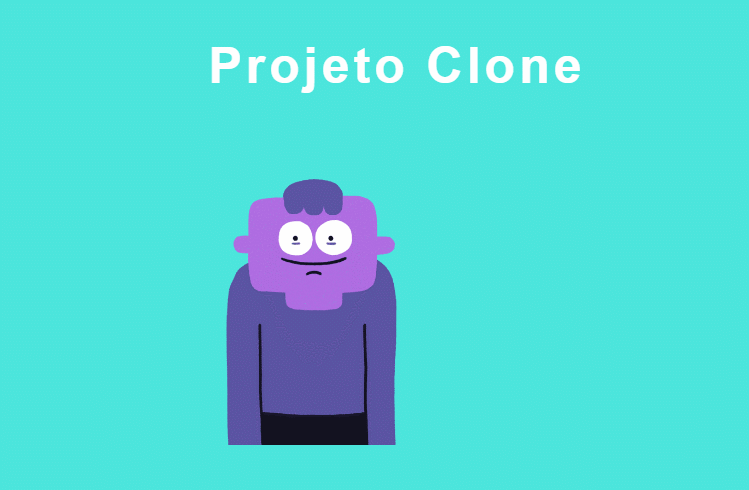

# 🐱‍👤 Projeto Clone 🐱‍👤
Uma aplicação totalmente configurada para você iniciar seu projeto sem se preocupar!
## Fast View

## Como usar o projeto:
### `npx create-next-app nomeSeuProjeto --example linkProjetoClone`

Ira criar seu projeto atráves do projeto Clone.

## Como rodar o projeto Clone:

### `npm run dev`

Roda o projeto em modo desenvolvimento.\
Abra [http://localhost:3000](http://localhost:3000) no seu navegador para visualizar.

## Testes automatizados:
### `npm run test`

Executas todos os testes unitarios da aplicação.

## 💡 Oque foi configurado pra você:

- Eslint
- Prettier
- Jest
- Husky
- Storybook
- Babel
- Styled-Components
- Typescript
- Next-images

